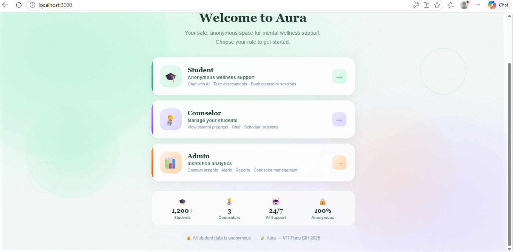
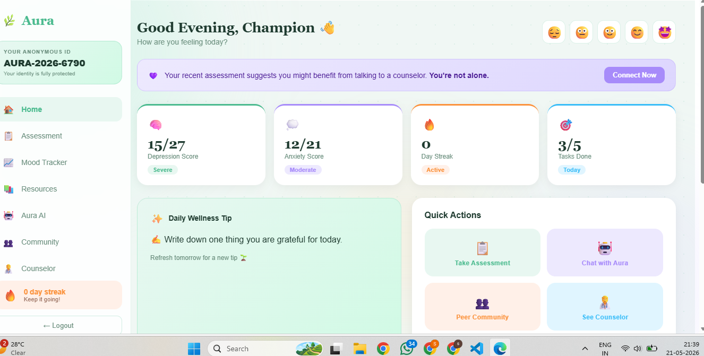
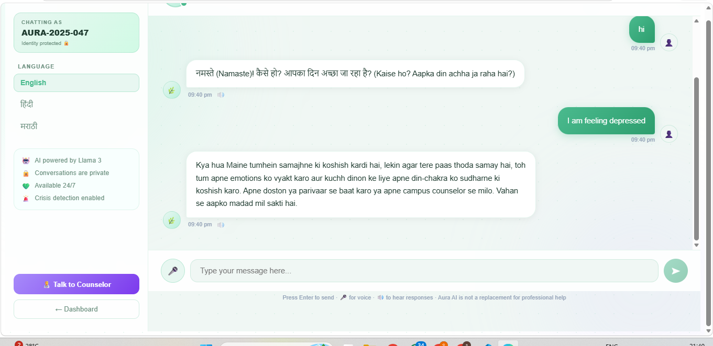
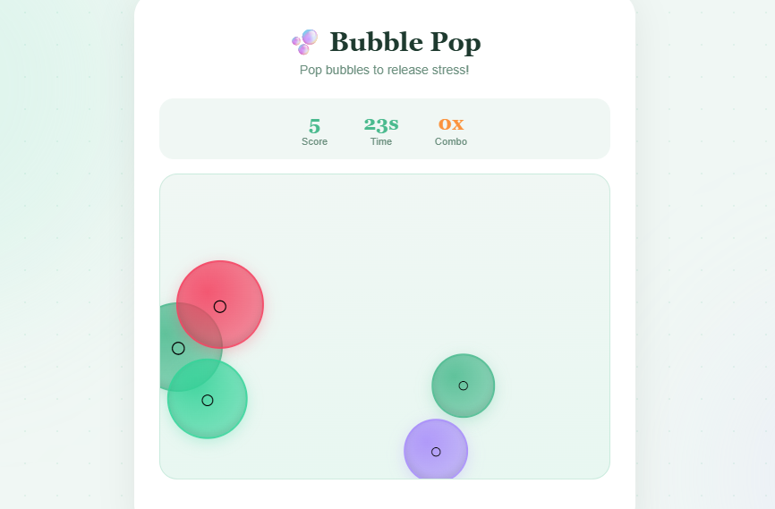
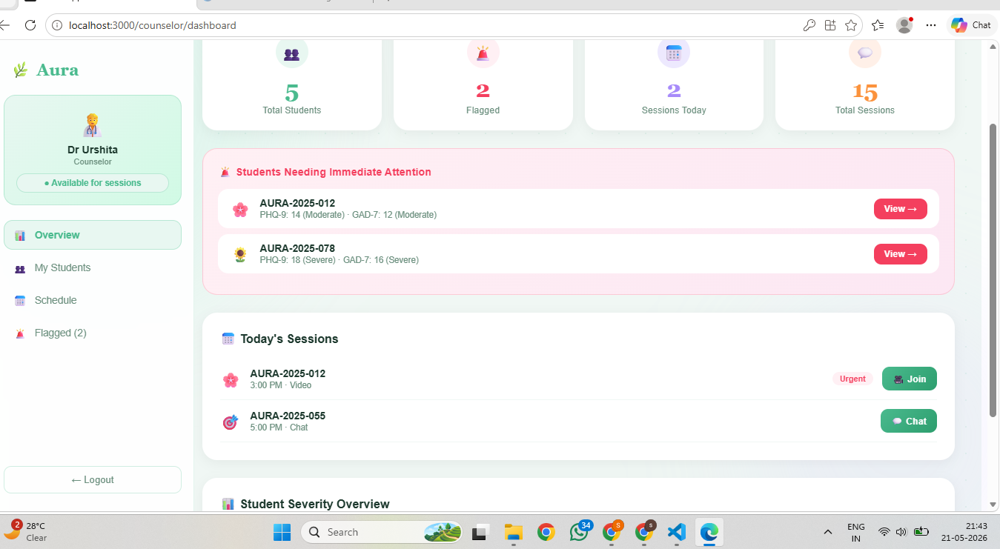
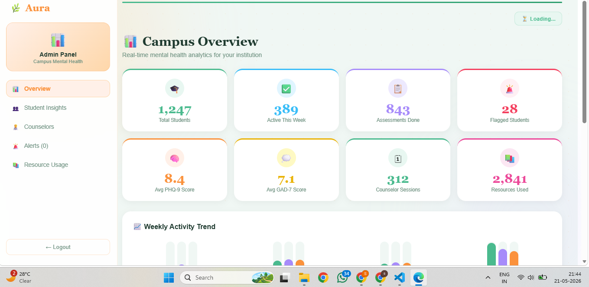
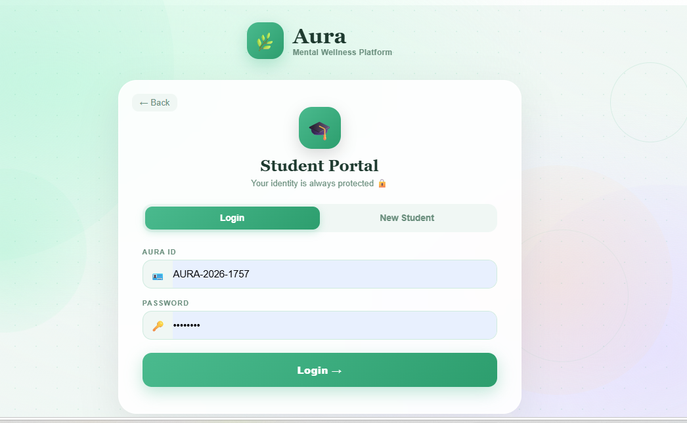

# 🌿 Aura — Anonymous Mental Wellness Platform for Students

**A safe, anonymous space where college students can check in on their mental health, talk to an AI companion, track their mood, connect with peers, and reach a real counselor — all without revealing their identity.**

> 🎓 Built for VIT Pune — Smart India Hackathon (SIH) 2025

---

## 📖 Table of Contents
- [About the Project](#-about-the-project)
- [Key Highlights](#-key-highlights)
- [Screenshots](#-screenshots)
- [Tech Stack](#-tech-stack)
- [Architecture](#-architecture)
- [Getting Started](#-getting-started)
- [Project Structure](#-project-structure)
- [Roadmap](#-roadmap)
- [Disclaimer](#-disclaimer)

---

## 🧠 About the Project

Mental health struggles are common on college campuses, but stigma and fear of judgment keep many students from reaching out. **Aura** removes that barrier entirely — every student gets an anonymous ID (`AURA-2026-XXXX`) instead of a name, so they can take real clinical assessments, talk to an AI companion, log their mood, post in the community, and book a counselor session, all while staying completely unidentifiable to anyone but themselves.

The platform serves three roles:

| Role | Experience |
|------|-----------|
| 🧑‍🎓 **Student** | Anonymous wellness dashboard — assessments, AI chat, mood tracking, games, community, counselor booking |
| 🧑‍⚕️ **Counselor** | Dashboard to view flagged/at-risk students, manage sessions, and join video calls |
| 🛡️ **Admin** | Real-time campus-wide mental health analytics and counselor workload management |

---

## ⭐ Key Highlights

- 🔒 **Fully Anonymous** — Students are identified only by a generated Aura ID; no real names are ever stored or shown
- 📋 **Clinical-Grade Assessments** — Built on **PHQ-9** (depression) and **GAD-7** (anxiety), the same screening tools used by real healthcare providers, with severity scoring (Mild/Moderate/Severe)
- 🤖 **Multilingual AI Companion** — Chat support powered by Llama 3, responding fluently in **English, Hindi, and Marathi**, including code-mixed Hindi-English
- 🚨 **Crisis Detection** — The AI recognizes signs of distress in real time and proactively surfaces a "You Are Not Alone" intervention screen, nudging students toward a real counselor
- 📹 **Live Video Counseling** — One-click video sessions between students and counselors via Jitsi Meet, no app download required
- 📊 **Mood Tracking with Streaks** — Daily mood check-ins visualized as a 7-day trend, with streak tracking to encourage consistency
- 🎮 **Built-in Stress Relief** — Breathing exercises, a memory match game, and a bubble-pop game, all playable directly in-app
- 🩺 **Counselor Triage View** — Counselors instantly see which students need immediate attention, ranked by assessment severity
- 📈 **Live Admin Analytics** — Campus-wide dashboards tracking active students, average PHQ-9/GAD-7 scores, flagged cases, and counselor workload — refreshed in real time
- 🌐 **Peer Community** — Anonymous, topic-tagged posts (Anxiety, Stress, Motivation, Study Tips) where students support each other

---

## 📸 Screenshots

### Landing & Onboarding

*Students choose their role — Student, Counselor, or Admin — to enter their dedicated experience.*

### Student Wellness Report

*PHQ-9 and GAD-7 results presented clearly, with personalized recommendations based on severity.*

### AI Chat Support (Multilingual)

*Conversational support that responds naturally in English, Hindi, and Marathi.*

### Mood Tracker

*7-day mood trend visualization with streaks and a recent mood log.*

### Anonymous Peer Community

*Students share and support each other anonymously, tagged by topic.*

### Counselor Dashboard

*Counselors see flagged students sorted by severity and join sessions in one click.*

### Admin Analytics

*Real-time, anonymized campus mental health metrics for institutional oversight.*

---

## 🛠️ Tech Stack

**Frontend**
- React 19, React Router
- Axios
- Lucide React (icons)
- i18n for multilingual support

**Backend**
- Node.js, Express
- Role-based authentication middleware

**Database & Auth**
- [Supabase](https://supabase.com) (PostgreSQL + Authentication)

**AI & Real-Time Communication**
- Llama 3 (multilingual conversational AI)
- Jitsi Meet (video counseling sessions)

---

## 🏗️ Architecture

```
┌─────────────┐        HTTP/REST        ┌──────────────┐        ┌──────────────┐
│   React     │  ─────────────────────▶ │   Express    │ ─────▶ │   Supabase   │
│  Frontend   │ ◀───────────────────── │   Backend    │ ◀───── │  (Postgres)  │
└─────────────┘                         └──────┬───────┘        └──────────────┘
   localhost:3000                               │
                                                  ▼
                                          ┌───────────────┐
                                          │   Llama 3 AI  │
                                          │  (Chat/Crisis)│
                                          └───────────────┘
```

The React frontend handles all student/counselor/admin UI. The Express backend exposes REST routes for auth, assessments, mood tracking, sessions, and the AI chatbot, storing all data in Supabase under anonymized student IDs. Video sessions are handled via Jitsi Meet links generated per counselor-student pairing.

---

## 🚀 Getting Started

### Prerequisites
- Node.js v18+
- npm
- A free [Supabase](https://supabase.com) account/project

### 1. Clone the repository
```bash
git clone https://github.com/Suhani1707/aura-ai.git
cd aura-ai
```

### 2. Set up the frontend
```bash
npm install
```

Create a `.env` file in the project root:
```env
REACT_APP_SUPABASE_URL=your_supabase_project_url
REACT_APP_SUPABASE_ANON_KEY=your_supabase_anon_key
```

Start the frontend:
```bash
npm start
```
Runs at `http://localhost:3000`

### 3. Set up the backend
```bash
cd backend
npm install
```

Create a `.env` file inside `backend/`:
```env
SUPABASE_URL=your_supabase_project_url
SUPABASE_KEY=your_supabase_service_or_anon_key
PORT=5000
```

Start the backend:
```bash
node server.js
```
Runs at `http://localhost:5000`

---

## 📁 Project Structure

```
aura-project/
├── backend/
│   ├── routes/
│   │   ├── auth.js          # Anonymous ID login & role-based auth
│   │   ├── assessment.js    # PHQ-9 / GAD-7 assessment endpoints
│   │   ├── mood.js          # Mood tracking endpoints
│   │   ├── sessions.js      # Counselor session booking & video links
│   │   ├── chatbot.js       # Multilingual AI chat + crisis detection
│   │   └── admin.js         # Admin analytics operations
│   ├── middleware/
│   │   └── auth.js          # Auth/role verification middleware
│   ├── supabase.js          # Supabase client configuration
│   └── server.js            # Express app entry point
│
├── public/
│   └── audios/               # Breathing, meditation, nature sound files
│
└── src/
    ├── pages/
    │   ├── Login.jsx
    │   ├── student/
    │   │   ├── Dashboard.jsx
    │   │   ├── Assessment.jsx
    │   │   ├── Chat.jsx
    │   │   ├── MoodTracker.jsx
    │   │   ├── Community.jsx
    │   │   ├── Counselor.jsx
    │   │   ├── Resources.jsx
    │   │   └── Games/
    │   │       ├── BreathingGame.jsx
    │   │       ├── MemoryGame.jsx
    │   │       └── BubbleGame.jsx
    │   ├── counselor/
    │   │   ├── CounselorLogin.jsx
    │   │   └── CounselorDashboard.jsx
    │   └── admin/
    │       └── AdminDashboard.jsx
    ├── components/            # Shared & role-specific UI components
    ├── context/                # App-wide context providers
    └── i18n/                    # English, Hindi, Marathi translations
```

---

## 🗺️ Roadmap

- [ ] Real-time chat between students and counselors (currently AI-only)
- [ ] Push notifications for counselor responses
- [ ] Deployed live demo link
- [ ] Mobile-responsive PWA support
- [ ] Expanded crisis-response protocol with verified helpline integration

---

## ⚠️ Disclaimer

Aura AI is **not a replacement for professional mental health care**. The AI chat and assessments are designed to support and guide students toward appropriate help, including licensed counselors. If you or someone you know is in crisis, please reach out to a mental health professional or a crisis helpline immediately.

---

<p align="center">Built with care, for student wellbeing 🌿</p>
